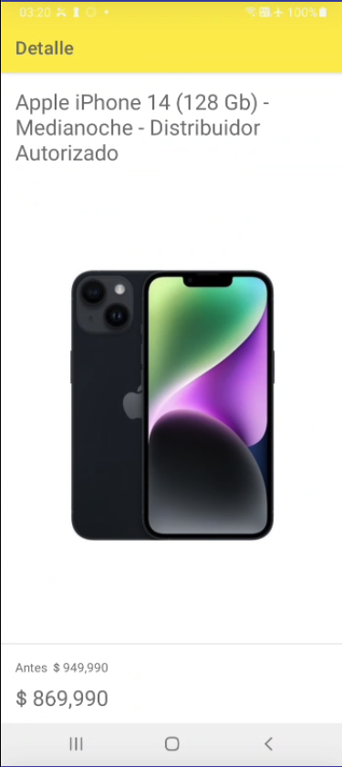

# Meli Play android

Este es un proyecto de desafio para android (Meli play)

## Requerimientos

- Java version 17
- Kotlin 1.9.0
- Android Gradle 8.1.2
- Android Studio Giraffe

## Descripción

La aplicación cuenta con las funcionalidades de busqueda y listado de productos de mercado libre, la cual permite buscar un producto por texto,
listar los productos en relación a la busqueda, y ver el detalle del producto.

### Screenshots

 

## Como probar y correr el proyecto

- Check Lint
```
./gradlew lint
```

- Check 
```
./gradlew check
```

- Detekt
```
./gradlew detekt
```

- Tests
```
./gradlew test
```

- Build app
```
./gradlew build
```

## Tecnologias/Librerias usadas

- Kotlin
- Kotlin DSL
- Retrofit
- Coroutines
- OkHttp
- Gson
- Coil

### Otros

- Junit
- LeakCanary
- Detek


### APIS usadas

- Search by query 
  - GET https://api.mercadolibre.com/sites/MLC/search?q=iphone

- Get item by ID
  - GET https://api.mercadolibre.com/items?ids=MLC12345

## Arquitectura

Arquitecture Modular, cada modulo es una feature, y para cada module se aplica una Clean Arquitecture con enfoque en el flujo unidireccional

### Modulos

- Core
  - Network
  - Navigation

- Features
  - Search
  - Detail

### Capas ppr feature

- Data
- Domain
- Presentation
  - ui
  - di

## Documentacion/Referencias

- https://developer.android.com/topic/architecture?hl=es-419
- https://developer.android.com/topic/architecture/recommendations?hl=es-419
- https://developer.android.com/topic/modularization?hl=es-419