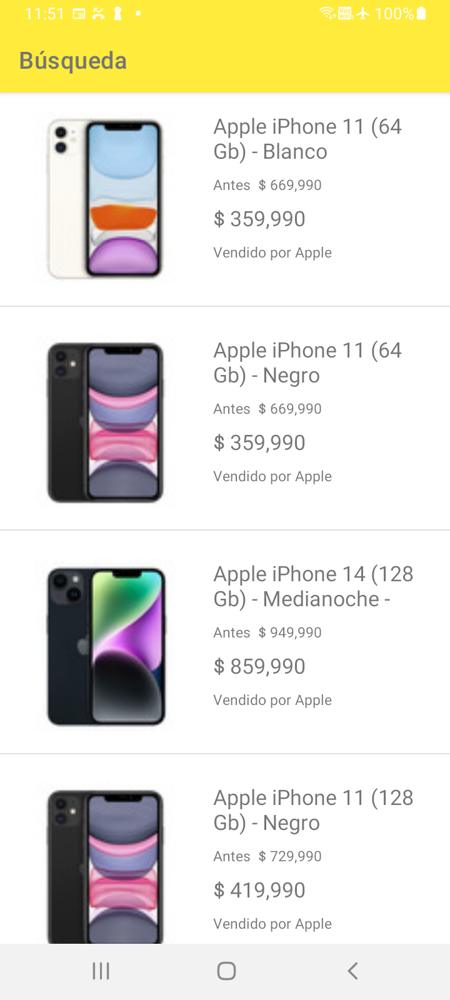
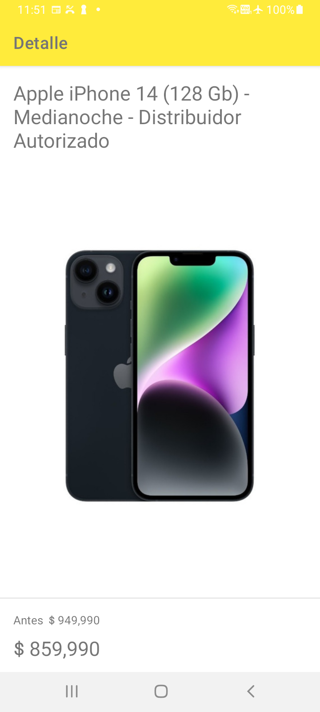

# Meli Play android

Challenge de android (Meli play)

## Requerimientos

- Java version 17
- Android Gradle 8.1.2
- Android Studio Giraffe

## Descripción

La aplicación cuenta con las funcionalidades de búsqueda y listado de productos de Mercado Libre

## Features

* Búsqueda
* Listado de resultados
* Detalle del Item

### Screenshots

|Search|Detail|
|:--:|:--:|
|||


## Como probar y correr el proyecto

- Check 
```

./gradlew lint
./gradlew check
./gradlew detekt

```

- Tests
```

./gradlew test

```

- Build app
```

./gradlew build

```

## Tecnologias/Librerias usadas

* Kotlin
* Kotlin DSL
* Retrofit
* Coroutines
* OkHttp
* Gson
* Coil
* Junit 5
* LeakCanary
* Detekt


## APIS usadas

- Search by query 
```

curl --location 'https://api.mercadolibre.com/sites/MLC/search?q=iphone' \

```

- Get item by ID
```

curl --location 'https://api.mercadolibre.com/items?ids=MLC12345' \
  
```

## Arquitectura

* Arquitecture modular basada en features. 
* Para cada feature se usa clean Archuitecture con enfoque en flujo unidireccional

## Modulos

* Network
* Navigation
* Components
* Search
* Detail

## Estructura de capas por feature

* Data
* Domain
* Presentation
  * ui
  * di

## Documentación/Referencias

* [Guia de Arquitectura Android](https://developer.android.com/topic/architecture?hl=es-419)
* [Modularización Android](https://developer.android.com/topic/modularization?hl=es-419)